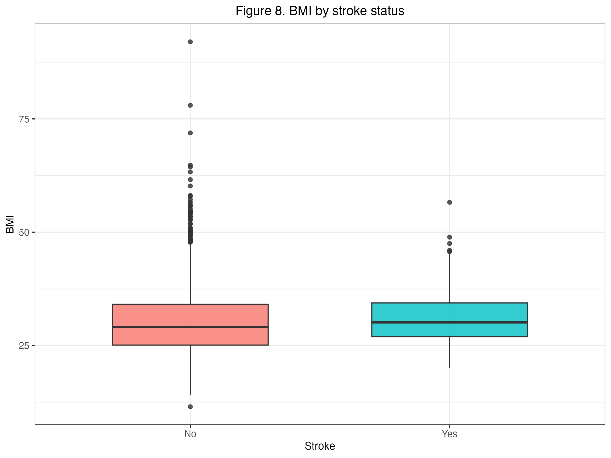

```{r setup}
#| include: false
library(tidyverse)
library(knitr)
library(kableExtra)

# Load shared data artifacts for inline reporting
stroke <- read_csv("../data/healthcare-dataset-stroke-data.csv")
stroke_summary  <- read_csv("../results/tables/01_summary-stats.csv")
val_metrics     <- read_csv("../results/tables/13_all-validation-metrics.csv")
test_metrics    <- read_csv("../results/tables/14_final-model-test-metrics.csv")
```

# Abstract

This project investigates whether a patient's likelihood of stroke can
be predicted using a set of clinical features from the Stroke Prediction
Dataset. The dataset contains `r format(nrow(stroke), big.mark=",")`
observations and includes variables such as age, gender, hypertension,
heart disease, residence type, average glucose level, BMI, smoking
status, work type, marital status, and prior stroke occurrence. After
cleaning and wrangling the data, we conducted exploratory data analysis
to identify patterns between these predictors and stroke outcomes, then
developed a k-nearest neighbors classification model using an 80/20
train-test split and 5-fold cross-validation for model tuning.

Our exploratory analysis suggested that age, hypertension, heart
disease, BMI, and average glucose level were the most informative
predictors, while variables such as id, work type, and marital status
contributed little to model performance. The final model achieved high
overall accuracy on the test set, but the dataset was heavily imbalanced
and the model classified nearly all cases as "No stroke," failing to
meaningfully identify positive stroke cases.

These findings suggest that future work should consider alternative
modeling strategies, better methods for handling class imbalance, and
additional predictors related to lifestyle, genetics, and medical
history.

# Introduction

According to the National Cancer Institute, a stroke occurs when brain
tissue is damaged by a loss of blood flow to certain parts of the brain
[@nih]. It is a significant global health issue, with an annual
mortality rate of 5.5 million people worldwide, making it the second
leading cause of death. Understanding the factors that contribute to
stroke occurrence is crucial for prevention and effective treatment. Age
is widely recognized as the strongest determinant of stroke risk, with
the likelihood of experiencing a stroke doubling every decade after the
age of 55. Additionally, hypertension has been identified as the leading
risk factor of stroke in both developing and developed nations
[@donker2018].

Our research question explores the ability to accurately predict the
likelihood of a stroke in a patient given a set of clinical features.
Utilizing the Stroke Prediction Dataset, which comprises
`r nrow(read_csv("../data/processed/stroke_training.csv")) +
   nrow(read_csv("../data/processed/stroke_validation.csv")) +
   nrow(read_csv("../data/processed/stroke_testing.csv"))`
observations..., we aim to identify patterns among these features and
aid in the development of prevention strategies.

# Methods and Results

Our exploratory data analysis exclusively uses the training data set.
Summary statistics for categorical and numeric variables are presented
in @tbl-summary.

```{r}
#| label: tbl-summary
#| tbl-cap: "Summary statistics for the variables in the stroke training dataset."

stroke_summary %>% 
  head(25) %>% 
  knitr::kable()
```

# Visualizations Feature Selection

The `id` feature was removed as it has no biological impact on stroke
occurrence. We employed `ggpairs` to identify correlations (@fig-pairs).

{#fig-pairs}

## Demographic and Clinical Predictors

As seen in @fig-gender, there was no significant difference between
males and females in terms of the percentage of stroke cases.

{#fig-gender}

With regards to age (@fig-age), the proportion of stroke cases increases
noticeably after age 50, suggesting it is one of the strongest
predictors.

{#fig-age}

Patients with hypertension (@fig-hypertension) and heart disease
(@fig-heartdisease) are roughly twice as likely to have a stroke.

::: {layout-ncol="2"}
{#fig-hypertension}

{#fig-heartdisease}
:::

Conversely, there is no significant difference in likelihood for those
residing in urban versus rural areas (@fig-residence).

{#fig-residence}

## Metabolic Factors

Patients who experienced a stroke tend to have higher average glucose
levels (@fig-glucose) and slightly higher BMI (@fig-bmi).

::: {layout-ncol="2"}
{#fig-glucose}

{#fig-bmi}
:::

# Building The Model

## Finalized Features

We moved forward with the features defined in our preprocessing script.
We excluded `id`, `ever_married`, and `work_type` as they were
determined to be too broad or uninformative.

## Model Comparison and Tuning

For the **kNN model**, we performed a coarse sweep of neighbors, finding
that performance plateaus around $k=150$ (@fig-coarse-tuning).

{#fig-coarse-tuning}

For the **XGBoost model**, we analyzed feature importance. Age and
average glucose level emerged as the most critical features
(@fig-xgb-vip).

{#fig-xgb-vip}

## Model Selection

We compared the three models on the validation set using J-index,
sensitivity, and accuracy (@fig-metrics).

{#fig-metrics}

Inspecting the confusion matrices in @fig-cms, we can evaluate how each
model handled false positives and false negatives.

{#fig-cms}

Based on the highest J-Index, the
**`r val_metrics |> filter(.metric == "j_index") |> arrange(desc(.estimate)) |> slice(1) |> pull(model)`**
model was selected as the best performing architecture.

# Final Evaluation

The best model was evaluated on the held-out test set (@fig-final-cm). It achieved a
final J-index of
**`r test_metrics |> filter(.metric == "j_index") |> pull(.estimate) |> round(4)`**.

{#fig-final-cm}

# Discussion

The research project aimed to accurately predict the occurrence of
stroke in patients based on a set of clinical features. The researchers
utilized the Stroke Prediction Dataset, which included information on
`r ncol(stroke)` variables.

Through backwards selection, age, average glucose level, and the
presence of pre-existing heart disease emerged as the strongest
predictors of stroke for our logistic regression model. Age was
significant in determining stroke risk, with the likelihood of
experiencing a stroke doubling every decade after the age of 55. Heart
disease and average glucose levels were also identified as significant
risk factors for stroke.

However, the research did not yield the expected results. The occurrence
of false positives are quite high, and the model also predicted some
false negatives. In the context of stroke risk, false positives are less
serious than false negatives, while the former would still result in
unnecessary usage of medical resources and costs, the latter could
potentially have serious or lethal consequences.

## Potential Limitations

Our current classification model focuses on determining whether a person
has had a stroke based on the predictors utilized in our analysis. One
limitation is that the dataset used represents a snapshot of stroke
cases at a specific point in time. Additionally, our model does not
account for potential risk factors that were not included in the dataset
but may contribute to stroke occurrence.

## Impacts

### Early Intervention

By being able to predict stroke risks, healthcare providers can better
identify individuals who are at a higher risk of stroke before the
deadly event happens. Early identification has the potential to
significantly reduce the occurrence of strokes and further complications
by allowing individuals to develop personalized treatment plans with
medical professionals to improve their quality of life.

### Education and Awareness

Our findings can be used to educate future generations of the risk
factors that are associated with having a stroke. This can encourage
them to live a healthier and more positive lifestyle. As well, this may
offer those who have risk factors that are genetic and not lifestyle
related, a better understanding of their risks. This will also benefit
policy making. For example, if the model identifies smoking as a strong
predictor of a stroke, people in public health can prioritize
initiatives that better control smoking and be more specfic in their
messages regarding the long term effects.

## What future questions could this lead to?

One key area for future exploration is the generalizability of the model
in real-word scenarios. This is specifically important in the event of
insurance companies or governments deciding to use this technology in
order to push their specific agendas. This may lead to unfair outcomes
that discriminate or present biases based on the demographic of the
original sample it was trained with. As refined and well-trained the
model can be, it is crucial to consider the potential exceptions and
variations that arise due to the oddities of human biology and
environmental factors. Therefore this research can lead to future
studies that focus on assessing the models ability across various
populations. Other areas that can be explored are specific aspects of
the predictors explored in this analysis. For example, one of our
predictors is BMI, which is shown to be linked to all-cause mortality.
However, BMI does not differentiate between fat mass and muscle mass
(Cheung et al, 2015). Considering muscle mass is inversely associated
with mortality (Lee & Giovannucci, 2018), researchers may want to see to
what degree does fat mass associate with all-cause mortality, and in our
specific case, stroke.

# References

::: {#refs}
:::
