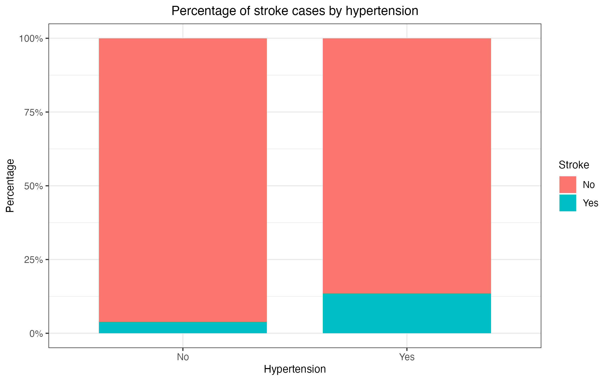
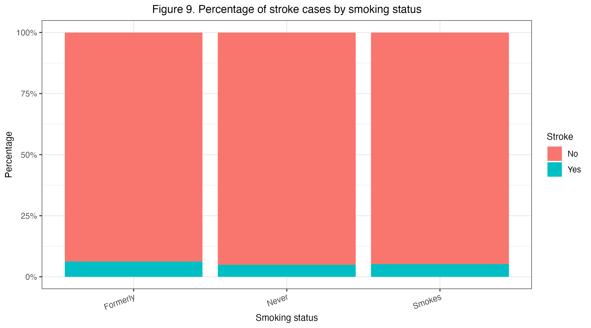
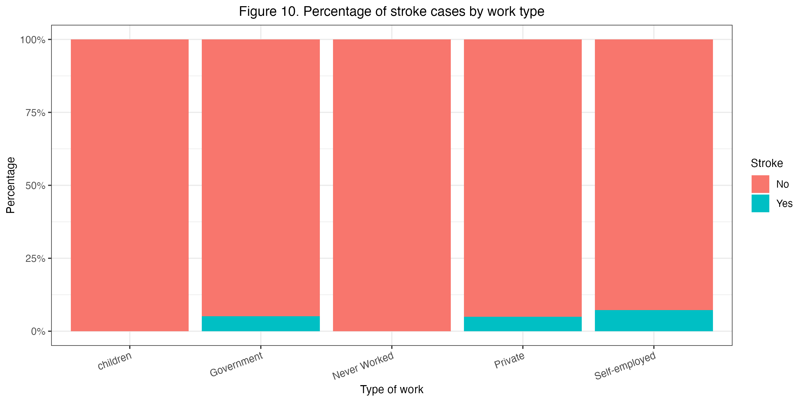
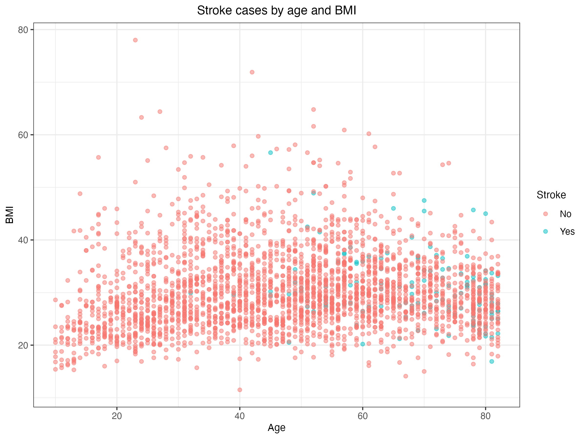

```{r setup}
#| include: false
library(tidyverse)
library(themis)
library(knitr)
library(kableExtra)

# Load shared data artifacts for inline reporting
stroke          <- read_csv("../data/healthcare-dataset-stroke-data.csv")
stroke_training <- read_csv("../data/processed/stroke_training.csv")
stroke_summary  <- read_csv("../results/tables/01_summary-stats.csv")
knn_coarse      <- read_csv("../results/tables/02_coarse-knn-cv-results.csv")
knn_fine        <- read_csv("../results/tables/03_fine-knn-cv-results.csv")
knn_val         <- read_csv("../results/tables/04_knn-validation-metrics.csv")
logreg_terms    <- read_csv("../results/tables/06_logreg-backward-selection-terms.csv")
logreg_params   <- read_csv("../results/tables/07_logreg-best-params.csv")
logreg_val     <- read_csv("../results/tables/08_logreg-validation-metrics.csv")
xgb_params      <- read_csv("../results/tables/10_xgboost-best-params.csv")
xgb_val         <- read_csv("../results/tables/11_xgboost-validation-metrics.csv")
val_metrics     <- read_csv("../results/tables/13_all-validation-metrics.csv")
test_metrics    <- read_csv("../results/tables/14_final-model-test-metrics.csv")
```

# Abstract

This project investigates whether a patient's likelihood of stroke can
be predicted using a set of clinical features from the Stroke Prediction
Dataset. The dataset contains `r format(nrow(stroke), big.mark=",")`
observations and includes variables such as age, gender, hypertension,
heart disease, residence type, average glucose level, BMI, smoking
status, work type, marital status, and prior stroke occurrence. After
cleaning and wrangling the data, we conducted exploratory data analysis
to identify patterns between these predictors and stroke outcomes, then
developed a k-nearest neighbors classification model using an 80/20
train-test split and 5-fold cross-validation for model tuning.

Our exploratory analysis suggested that age, hypertension, heart
disease, BMI, and average glucose level were the most informative
predictors, while variables such as id, work type, and marital status
contributed little to model performance. The final model achieved high
overall accuracy on the test set, but the dataset was heavily imbalanced
and the model classified nearly all cases as "No stroke," failing to
meaningfully identify positive stroke cases.

These findings suggest that future work should consider alternative
modeling strategies, better methods for handling class imbalance, and
additional predictors related to lifestyle, genetics, and medical
history.

# Introduction

According to the National Cancer Institute, a stroke occurs when brain
tissue is damaged by a loss of blood flow to certain parts of the brain
[@nih]. It is a significant global health issue, with an annual
mortality rate of 5.5 million people worldwide, making it the second
leading cause of death. Understanding the factors that contribute to
stroke occurrence is crucial for prevention and effective treatment. Age
is widely recognized as the strongest determinant of stroke risk, with
the likelihood of experiencing a stroke doubling every decade after the
age of 55. Additionally, hypertension has been identified as the leading
risk factor of stroke in both developing and developed nations.

However, it is worth noting that there are other risk factors that
exist, some of which are challenging to quantify accurately. These
factors contribute to the complexity of predicting likelihood of a
stroke. In light of this, our research question aims to address this
challenge by **exploring the ability to accurately predict the
likelihood of a stroke in a patient given a set of clinical features**.

To answer this research question, we will be utilizing the Stroke
Prediction Dataset, available via Kaggle. The dataset comprises 5110
observations and contains 12 different variables which make up our
clinical features for patients. These variables include gender, age,
hypertension, heart disease, marriage status, type of work
(self-employed/private/children/government/never worked), residence
(rural or urban), average glucose levels, BMI, smoking status, and
whether the patient has ever had a stroke.

By leveraging this dataset, we aim to identify patterns among these
clinical features and the occurrence of stroke. This analysis will
contribute to our understanding of the predictive power of these factors
and potentially aid in the development of effective strategies for
stroke prevention and management.

# Methods and Results

## Loading Data

```{r}
#| label: display-stroke-data
#| echo: false
#| message: false

stroke
```

We will next clean/wrangle our data into a tidy format - this involves
the following steps: renaming of columns, converting the string
“Unknown” into NA values, converting categorical variables into factors,
renaming these factors into human-readable names, converting columns
that should be numerical into doubles. We will drop the rows with *NA*
values from the dataset, so that we continue analysis only will
fully-formed data.

To predict whether a patient will experience a stroke, we will develop a
k-nearest neighbors classification model. To do so, we need to split our
dataset using part of it to train the model and the other part of it to
test the model. The training data will be used to both select the
features used in the final model and to tune the number of neighbors
used in classification, and the testing data will be used to evaluate
the model’s accuracy on unseen data.

We will select an 80/10/10 split for training, validation, and test
data, and will set `strata=stroke` to ensure that all sets have a
proportionate amount of the outcome we are predicting.

```{r}
#| label: display-training-set
#| echo: false
#| message: false

stroke_training
```

Our exploratory data analysis exclusively uses the training data set.
Summary statistics for categorical and numeric variables are presented
in @tbl-summary.

```{r}
#| label: tbl-summary
#| tbl-cap: "Summary statistics for the variables in the stroke training dataset."

stroke_summary %>% 
  head(25) %>% 
  knitr::kable()
```

# Visualizations and Justification for Feature Selection

Next, we need to determine which of the original datasets’ features will
be useful in determining whether or not a patient will experience a
stroke. This is called exploratory data analysis and we begin by
plotting our features to visually determine if there is a correlation
between the feature and the probability of a stroke.

The first feature of the original dataset that will be removed from
analysis is id - this simply corresponds to a patient’s ID and has no
impact on whether or not a patient will have a stroke.

## Preliminary Analysis

To begin our analysis, we employed the ggpairs tool (@fig-pairs),
enabling us to gain a holistic view of the dataset and its clinical
variables. By generating a matrix where each variable was plotted
against one another with whether a patient had a stroke before, we could
visually identify variables that had correlations with one another or
with stroke. Consequently, this provided us with valuable insights into
the variables that needed further investigation below and those that
could be excluded due to their lack of significance in our analysis.

     
{#fig-pairs}
  

As seen in @fig-gender, there was no significant difference between
males and females in terms of the percentage of stroke cases.

     
{#fig-gender}
  

With regards to age (@fig-age), the proportion of stroke cases is very
low among younger patients and increases noticeably at older ages. In
particular, the proportion begins to rise after around age 50 and
becomes much more pronounced among patients over 60. This suggests that
age is one of the strongest predictors of stroke in the dataset.

     
{#fig-age}
  

Patients with hypertension (@fig-hypertension) and heart disease
(@fig-heartdisease) are roughly twice as likely to have a stroke, which
is around 12.5% of the cases.

     
{#fig-hypertension}
  

Those who have suffered heart disease (@fig-heartdisease) are roughly
twice as likely to have a stroke, which is around 20-25% of the cases.

     
{#fig-heartdisease}
  

Conversely, there is no significant difference in likelihood for those
residing in urban versus rural areas (@fig-residence).

     
{#fig-residence}
  

There is an association between stroke cases and average glucose level
(@fig-glucose). Patients who had experienced a stroke tend to have
higher glucose levels on average than those who had not. While there is
overlap between the two groups, the stroke group shows a higher center
and a wider spread.

     
{#fig-glucose}
  

BMI (@fig-bmi) appears to be somewhat associated with stroke status,
although the separation is weaker than for age. Patients with a prior
stroke tend to have slightly higher BMI values on average, but there is
substantial overlap between the two groups.

     
{#fig-bmi}
  

The percentage of cases are quite similar between the three groups.
However, those who have formerly smoked have a slightly higher risk of
stroke than those who smoke. This may be due to current smokers being
younger or having less overall damage than those who are former smokers.
Potentially, those who are former smokers may have been heavy smokers
which could explain why they quit smoking compared to those who
currently smoke. Interestingly, those who have never smoked have the
same likelihood of suffering a stroke as those who currently smoke. This
means that other lifestyle factors likely play a significant role in the
risk of getting a stroke.

     

  

Those who are self-employed are roughly twice as likely to suffer a
stroke than those who work in government or in the private sector, at
around 20% of cases. Potentially, this is due to self employed
participants being in more incidents where their blood pressure is high
because of the uncertainties that are associated with being in that work
type.

     

  

## Further Analysis

To further explore the relationships between stroke and various clinical
variables, we conducted an analysis focusing on two key variables in
relations to strokes. By examining their associations with stroke, we
aimed to uncover potential interrelations and gain deeper insights into
their significance.

     

  

While in our initial analysis, Gender was found to not be a good
predictor of strokes, we decided to see if there was a correlation
between Age, Gender, and Strokes. It appears that the risk of stroke is
slightly greater in older men than older women; however, age seems to be
the more dominant feature. We decided to still consider gender in our
model as we were interested in this difference as there is a chance some
participants in the female population were pregnant, making blood more
likely clot which could cause a stroke.

     

  

All smoking groups had roughly equal numbers of stroke cases with the
common ground being that with age, there was an average increase in
percentage of strokes. The main difference is that the peak percentage
was highest in the group that currently “smokes” at around 50%. The
“never” smoking and “formerly” smoking groups peaked at percentages
between 40% to 50%. Interestingly, former smokers had higher percentages
than those who never smoked. Both of those groups had lower percentages
in comparison to current smokers, especially as age increases. This
suggests a relationship that has been observed in the past, where
stopping smoking for 5 years reduced the risk of stroke comparable to
that of a nonsmoker in most cases [@shah2010].

     

  

In general, individuals without hypertension and heart disease have the
lowest likelihood of having had a stroke, with a prevalence of less than
5%. However, those with both hypertension and heart disease exhibit the
highest percentage, around 18%, of stroke cases. Participants with only
heart disease have a lower likelihood, less than 18%, while those with
only hypertension have an approximate 13% likelihood of having had a
stroke.

     

  

While there isn't a strong association between heart disease and gender,
both male and female participants with heart disease have a notably
higher likelihood of having had a stroke compared to those without a
heart condition.

     

  

Age seems to be the main predictor of stroke when BMI is roughly under
25. However, this is not for a majority of the cases. Most cases where
participants have suffered a stroke, they tend to be above 50 years old
and have a BMI of greater than 25.

     

  

Our analysis suggests that participants with a BMI of 25 or higher make
up a majority of the instances of strokes regardless of average glucose
levels. The majority of participants who did not suffer a stroke had
average glucose levels of under 150. This tells us that BMI is a
stronger predictor of whether someone had a stroke, but maintaining
glucose levels at under 150 and BMI under 25 may reduce the risks of
stroke.

     

  

**Stroke Cases by Average Glucose Levels and Hypertension**

Most observations where the participant did not suffer a stroke are
associated with not having hypertension and with average glucose levels
below approximately 125. Stroke cases appear somewhat more frequently
among participants with higher glucose levels, but there remains
substantial overlap between stroke and non-stroke observations.
Participants with hypertension show a similar proportion of stroke cases
across a range of glucose levels, suggesting that once hypertension is
present, glucose level alone may not strongly differentiate stroke risk.

**Stroke Cases by Average Glucose Levels and Heart Disease**

A similar pattern appears when examining heart disease. Most non-stroke
observations occur among participants without heart disease and with
lower average glucose levels. Stroke cases appear somewhat more
frequently at higher glucose levels, although the separation between
stroke and non-stroke observations remains limited. Participants with
heart disease exhibit a slightly higher proportion of stroke cases
overall, but glucose level alone does not clearly distinguish between
stroke and non-stroke outcomes.

     


  

[**Stroke Cases by Type of Residence and Heart Disease**]{.underline}

The instances of stroke are roughly equal for those who have not
experienced heart disease, regardless of their type of residence. Cases
of strokes are also roughly equal between those who have experienced
heart disease, regardless of their residence type. Most cases of no
stroke are prevalent in those who did not experience heart disease and
overall, there is a higher occurrence of strokes for those who have
experienced heart disease.

[**Stroke Cases by Residence Type and Hypertension**]{.underline}

Regardless of one’s residence type, cases of strokes are roughly equal
when one experiences hypertension. The prevalence of strokes in those
who did not have hypertension is also equal in both urban and rural
areas, and most cases of no stroke are present in those who do not have
hypertension.

This suggests that hypertension and heart disease are likely a stronger
predictor of stroke than the type of residence one resides in.

# Building The Model

## Finalized Features

As a result of our data analysis, we will be moving forward with the
following features as predictors of stroke.

| Predictor             | Definition                                     |
|-----------------------|------------------------------------------------|
| Gender                | Whether the person is male or female           |
| Age                   | Age of patient                                 |
| Hypertension          | Diagnosed with hypertension or not             |
| Heart disease         | Diagnosed with heart disease or not            |
| Residence             | Living in a rural or urban area                |
| Average glucose level | Average glucose level in blood (mg/dL)         |
| BMI                   | Body mass index                                |
| Smoking status        | Current smoker, former smoker, or never smoked |
| Stroke                | Whether the person has had a stroke or not     |

And these are the features we will not be using in our analysis:

| Unused Predictor | Definition | Exclusion Justification |
|---------------------|--------------------|-------------------------------|
| id | ID of patient | Does not contribute to stroke prediction |
| ever_married | Ever married or not | This is too broad of a predictor\* |
| work_type | Either "Private", "Self-Employed", "Government job", "Never worked", "Children" | Options are too broad\*\* |

There were no research findings indicating that marital status alone is
predictive of stroke. Additionally, the variable does not account for
marital satisfaction, which at least for men has been shown to increase
long-term risk of stroke and all-cause mortality when satisfaction is
low [@levari2021].

We believe the `work_type` categories are not sufficiently detailed to
accurately predict stroke risk. Important socioeconomic factors such as
income level or occupational stress are not captured. Research has shown
that higher socioeconomic status is positively related to stroke risk
[@wang2019]. Additionally, studies suggest that white-collar workers may
have a higher risk of hypertension, a major risk factor for stroke,
compared to blue-collar workers [@liu2017].

## Model Comparison and Tuning

### kNN Model

Now that we have finalized the features that will be used in the model,
we define the final `recipe` that will be used. The predictors are
scaled as described above.

#### Hyperparameter Tuning

We will tune the neighbors parameter via 5-fold cross-validation with a
coarse sweep from 1 to 50 neighbors, incrementing by 5 neighbors,
followed by a finer sweep. We will use Youden's J statistic to evaluate
model performance as accuracy may improperly "mask" a poorly predictive
model due to the class imbalance present. Youden's J statistic accounts
both for sensitivity and specificity.

```{r}
#| label: knn-coarse-results
knn_coarse
```
     
{#fig-coarse-tuning}
  

We first performed a coarse sweep of neighbors from 0 to 200 stepping by
10. We found that performance was best at
k=`r knn_coarse |> filter(.metric == "j_index") |> arrange(desc(mean)) |> head(n=1) |> pull(neighbors)`
(@fig-coarse-tuning).

From @fig-coarse-tuning, we can see that model performance increases
steadily as the number of neighbors increases, reaching a plateau around
150. We will conduct a finer search around the 150-180 neighbour range
to land on a final value.

```{r}
#| label: knn-fine-results
knn_fine 
```

It was found that `k=159` results in the highest score on our training
dataset. We will use this value to develop our final kNN model with
`neighbors=159`.

#### Evaluation on Validation Set

We train our final model and fit it against our training dataset.

We used the model trained with the optimal number of neighbors, and then
use it to predict new values using our validation set and calculate the
J-index obtained:

```{r}
#| label: knn-val-results
knn_val
```

     

  

We get a final score of
`{r} knn_val |> filter(.metric == "j_index") |> pull(.estimate) |> round(3)`,
which is not too good as the metric is on a scale from \[0,1\]. From the
confusion matrix, we can see that the model is predicting a lot of True
negatives.

### Logistic Regression

Logistic regression is another model type that can be used for
classification tasks. It models the log-odds of the outcome as a linear
combination of predictors. We will additionally use backward stepwise
selection to prune non-informative terms, and tune an elastic-net
penalty to regularize the retained coefficients.

#### Backward Selection

We first define a recipe without SMOTE to maintain the class
distribution in the original dataset during backward selection.

The backward selection procedure removes predictors that do not improve
the AIC, and resulted in only the terms left above. We will use the
selected terms below in the final model.

```{r}
#| label: logreg-backward-selection-terms
logreg_terms
```

#### Hyperparameter Tuning

We add SMOTE back in for the tuning phase. The elastic-net penalty and
regularisation strength are tuned at the same time over a 10 by 10 grid
using 5-fold cross-validation evaluated by J-index as in the kNN model:

```{r}
#| label: logreg-backward-selection-params
logreg_params
```

The best performing model had penalty = `{r} logreg_params$penalty` and
mixture = `{r} logreg_params$mixture`, which corresponds to a pure ridge
regression model. We will use these hyperparameters to create the final
model to be tested on the validation set.

#### Evaluation on Validation Set

```{r}
#| label: logreg-val-metrics
logreg_val
```

     

  

The logistic model resulted in a substantial improvement over the kNN
model. The number of false positives is also reduced compared to the kNN
model.

## XGBoost

XGBoost is a gradient-boosted tree ensemble that naturally captures
non-linear relationships and feature interactions. We will first fit a
preliminary model to rank feature importance, using the information to
prune uninformative predictors, then tune the model's hyperparameters
using Bayesian optimisation.

#### Feature Importance

For the **XGBoost model**, we analyzed feature importance. Age and
average glucose level emerged as the most critical features
(@fig-xgb-vip).

     
{#fig-xgb-vip}
  

Features with importance that are near zero mainly contribute noise
without improving prediction. However, due to the dummy step on
catagorical predictors, we can see their their importance is split
across its levels and thus the importance of the predictor must be
interpreted as the sum of its importances across its derived dummy
variables.

Based on the importance ranking above, `age`, `avg_glucose_level`,
`bmi`, `hypertension`, `heart_disease`, and `smoking_status` are
informative while we can and drop categorical predictors that were
consistently near the bottom such as `gender` .

#### Bayesian Hyperparameter Tuning

We tune six hyperparameters simultaneously using Bayesian optimisation
(`tune_bayes`), which is more efficient than an exhaustive grid search
for high-dimensional parameter spaces. We run 10 initial random
evaluations followed by up to 30 Bayesian iterations, stopping early if
10 consecutive iterations fail to improve J-index:

```{r}
#| label: xgb-parameters
xgb_params
```

The best performing model was obtained with the hyperparameters listed
above and will be used to train the final model.

#### Evaluation on Validation Set

```{r}
#| label: xgb-val-metrics
xgb_val
```

     
{#fig-xgb-cm}
  

## Model Selection

We compared the three models on the validation set using J-index,
sensitivity, and accuracy (@fig-metrics).

     
{#fig-metrics}
  

Inspecting the confusion matrices in @fig-cms, we can evaluate how each
model handled false positives and false negatives.

     
{#fig-cms}
  

Looking at the three models, XGBoost performed the best in terms of J-Index. Inspecting the confusion matrices, we can see that it outperformed both the kNN and Logistic Regression models in terms of sensitivity, successfully eliminating all False Negatives (0). While the XGBoost model produced a higher number of False Positives (163) compared to kNN (118) and Logistic Regression (95), its perfect capture of positive stroke cases significantly boosted its overall performance. As the J-index metric weights both sensitivity and specificity equally, we will select the XGBoost model as our final candidate.

# Final Evaluation

```{r}
#| label: final-test-metrics
test_metrics
```

The best model was evaluated on the held-out test set. It achieved a
final J-index of
**`r test_metrics |> filter(.metric == "j_index") |> pull(.estimate) |> round(4)`**.

     
{#fig-final-cm}
  

# Discussion

The research project aimed to accurately predict the occurrence of
stroke in patients based on a set of clinical features. The researchers
utilized the Stroke Prediction Dataset, which included information on
`r ncol(stroke)` variables.

Through backwards selection, age, average glucose level, and the
presence of pre-existing heart disease emerged as the strongest
predictors of stroke for our logistic regression model. Age was
significant in determining stroke risk, with the likelihood of
experiencing a stroke doubling every decade after the age of 55. Heart
disease and average glucose levels were also identified as significant
risk factors for stroke.

However, the research did not yield the expected results. The occurrence
of false positives are quite high, and the model also predicted some
false negatives. In the context of stroke risk, false positives are less
serious than false negatives, while the former would still result in
unnecessary usage of medical resources and costs, the latter could
potentially have serious or lethal consequences.

## Potential Limitations

Our current classification model focuses on determining whether a person
has had a stroke based on the predictors utilized in our analysis. One
limitation is that the dataset used represents a snapshot of stroke
cases at a specific point in time. Additionally, our model does not
account for potential risk factors that were not included in the dataset
but may contribute to stroke occurrence.

## Impacts

### Early Intervention

By being able to predict stroke risks, healthcare providers can better
identify individuals who are at a higher risk of stroke before the
deadly event happens. Early identification has the potential to
significantly reduce the occurrence of strokes and further complications
by allowing individuals to develop personalized treatment plans with
medical professionals to improve their quality of life.

### Education and Awareness

Our findings can be used to educate future generations of the risk
factors that are associated with having a stroke. This can encourage
them to live a healthier and more positive lifestyle. As well, this may
offer those who have risk factors that are genetic and not lifestyle
related, a better understanding of their risks. This will also benefit
policy making. For example, if the model identifies smoking as a strong
predictor of a stroke, people in public health can prioritize
initiatives that better control smoking and be more specfic in their
messages regarding the long term effects.

## What future questions could this lead to?

One key area for future exploration is the generalizability of the model
in real-word scenarios. This is specifically important in the event of
insurance companies or governments deciding to use this technology in
order to push their specific agendas. This may lead to unfair outcomes
that discriminate or present biases based on the demographic of the
original sample it was trained with. As refined and well-trained the
model can be, it is crucial to consider the potential exceptions and
variations that arise due to the oddities of human biology and
environmental factors. Therefore this research can lead to future
studies that focus on assessing the models ability across various
populations. Other areas that can be explored are specific aspects of
the predictors explored in this analysis. For example, one of our
predictors is BMI, which is shown to be linked to all-cause mortality.
However, BMI does not differentiate between fat mass and muscle mass
[@cheung2021]. Considering muscle mass is inversely associated with
mortality [@lee2018], researchers may want to see to what degree does
fat mass associate with all-cause mortality, and in our specific case,
stroke.

# References
:::{#refs}
:::

